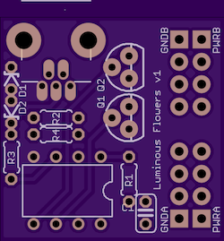
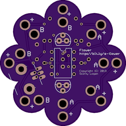

# Boards

There are two boards using essentially the same schematic.

*basic* is about 1 inch square

*flower* is shaped like a flower

# Code

The code is in `code/flowers.ino`. While the board should work with
V-USB, the code doesn't use that yet.
